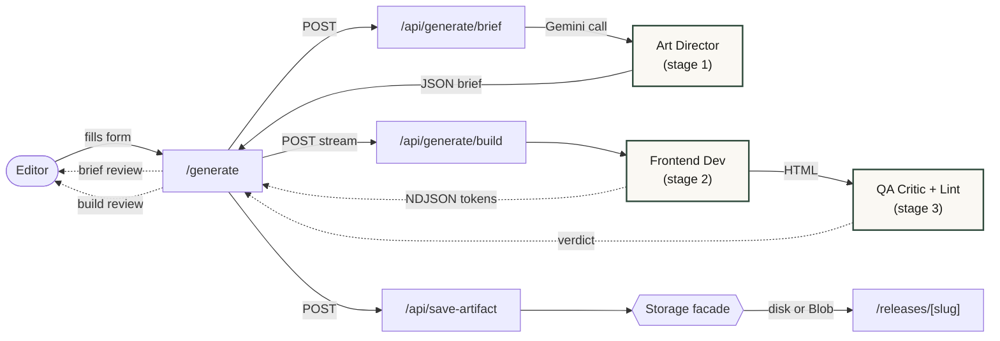
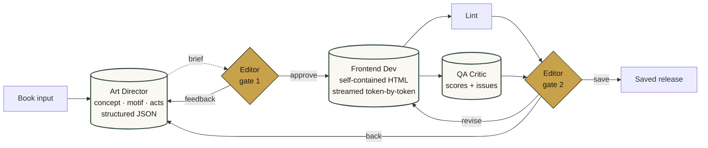
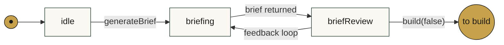
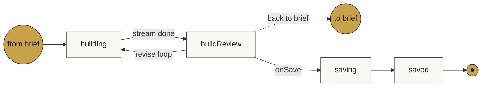

# Book in the (App)Shell

<div class="subtitle">An experiment in human-in-the-loop HTML-generation</div>

<div class="kicker">Elate<span>·</span>Bok</div>

<!--
Opening: the question this deck answers — can a book publisher replace the
per-book ad-agency promo workflow with an AI app? We'll walk the pipeline,
the human gates, every agent's actual prompt, the streaming preview
architecture, and how the generated HTML lands in the app shell.
-->

---
layout: default
---

# Where this came from

<div class="lede">
Bjørn D.: <em>"I think I have something for you..."</em>
</div>

<blockquote>The Gist: <i>how to AI-generate book release pages and inject inside NextJS application shell</i></blockquote>

<div class="questions">
Technically interesting parts:
<ul>
  <li><strong>SEO &amp; routing.</strong></li>
  <li><strong>Trusting generated HTML.</strong></li>
  <li><strong>Architecture.</strong></li>
  <li><strong>Prompt engineering.</strong></li>
</ul>
</div>

<div class="caveat">
This is an experiment, I'm no expert 😅.
</div>

<style>
.lede { font-size: 1.15rem; margin-top: 1rem; color: var(--shell-ink); max-inline-size: 62ch; line-height: 1.55; }
.lede em { color: var(--shell-brand); font-style: italic; font-family: var(--font-display); font-weight: 600; }
.questions { margin-top: 1.5rem; font-size: 0.95rem; color: var(--shell-ink); max-inline-size: 70ch; }
.questions ul { margin: 0.6rem 0 0; padding-left: 1.25rem; }
.questions li { margin-bottom: 0.45rem; line-height: 1.5; }
.questions strong { color: var(--shell-brand); font-weight: 600; }
.caveat { margin-top: 1.5rem; font-size: 0.9rem; color: var(--shell-muted); font-style: italic; max-inline-size: 64ch; }
</style>

<!--
* **SEO & routing** - The app shell has to own metadata, JSON-LD, canonical URLs, the purchase flow. The artifact owns the visual body. How do you compose them in Next's App Router without one breaking the other?</li>
* **Trusting generated HTML** - Sanitize, scope, isolate. What's strictly necessary and what's defense-in-depth?</li>
* **Architecture** - Where does the agent pipeline live? Where do you put the human? How to make the waiting for a response and the ability to control the output?</li>
* **Prompt engineering** - How would you encode a AD bureau to prompts and skills?</li>
-->

---
layout: default
---

# Results: <https://bookshell-puce.vercel.app/>

<div style="height: 100%">
  <div class="shot-wrap">
    <video :src="'/slides/slides-assets/gardens-of-the-moon.mp4'" autoplay loop muted></video>
    <p class="caption">
      Shell is Next.js — header, sticky buy bar, SEO, JSON-LD. Body between them is AI-generated HTML, scoped + sanitised at the server, dropped into <code>&lt;main&gt;</code>.<br /><a href="https://bookshell-puce.vercel.app/">Bookshell</a>
    </p>
  </div>
</div>

<style>
.shot-wrap { display: grid; grid-template-columns: 2fr 1fr; gap: 2rem; align-items: center; margin-top: 0.5rem; height: 90%; }
.shot-wrap video { height: 100%; object-fit: contain; border: 1px solid var(--shell-line); border-radius: 8px; box-shadow: 0 18px 40px -20px rgb(0 0 0 / 0.25); }
.caption { color: var(--shell-muted); font-size: 1rem; line-height: 1.55; }
.caption code { font-family: var(--font-mono); font-size: 0.9em; }
</style>

---
layout: default
---

# Architecture map



<div class="legend">
Dashed = user-visible streaming / approval gate · Solid = synchronous server call · the hexagon abstracts disk (local) ↔ Vercel Blob (prod).
</div>

<style>
.legend { font-size: 0.85rem; color: var(--shell-muted); text-align: center; margin-top: 1rem; }
.legend code { font-family: var(--font-mono); font-size: 0.9em; }
</style>

<!--
Caveats:
* no memory, roundtrips are new prompts
* fake Sanity (and Vercel blob)
-->

---
layout: default
---

# The 3-agent pipeline



<Alternatives>
<ul>
  <li><strong>Single mega-prompt</strong></li>
  <li><strong>Autonomous critic → revise loop</strong></li>
  <li><strong>Tool-calling agent picks sub-skills</strong></li>
</ul>
</Alternatives>

<!--
* **mega prompt**: shorter latency, no human gate. I felt left out
* **autonomous revise-loop**: unclear outputs, the javascript trap (the good parts). No trust-layer, drift potential. 
* tools/skills: scrollytelling skill super large, not simple with gemini, difference between LLM, Agent, Harness when using specialized system prompts?
-->

---
layout: default
---

# Phase state machine

<div class="phase-row">

**Brief loop** &nbsp;·&nbsp; <em>editor sends a note → re-generate the brief</em>



</div>

<div class="phase-row">

**Build &amp; save loop** &nbsp;·&nbsp; <em>editor asks for changes → revise, or goes back to brief</em>



</div>

<style>
.phase-row { margin-bottom: 0.5rem; }
.phase-row p { font-size: 0.92rem; color: var(--shell-ink); margin: 0 0 0.25rem; }
.phase-row em { color: var(--shell-muted); font-style: italic; }
</style>

<div class="legend2">
Source: <code>app/generate/flow/phase.ts</code>. Both feedback loops the app exists for are visible here — <code>briefReview → briefing</code> (editor sends a note on the brief) and <code>buildReview → building</code> (editor asks for changes on the built page).
</div>

<style>
.legend2 { font-size: 0.9rem; color: var(--shell-muted); margin-top: 0.5rem; max-inline-size: 72ch; }
.legend2 code { font-family: var(--font-mono); font-size: 0.9em; background: var(--shell-surface); border: 1px solid var(--shell-line); padding: 0.05em 0.3em; border-radius: 3px; }
</style>

---
layout: default
---

# LLM vs Agent vs Harness
<div>
  
</div>

<style>
  img { margin-top: -1.5em; transform: scale(0.95); }
</style>

<!--
lite för min egen del, kände att jag aldrig har tänkt över det så mycket. Speciellt när det kommer till skills vs context token savings.
-->

---
layout: default
---

# Agent 1 — Art Director

<div class="agent-meta">
<div><strong>Model</strong> · gemini-3-flash-preview, temperature 0.9, thinkingLevel HIGH</div>
<div><strong>Input</strong> · book metadata + optional cover + optional editor direction + optional praise</div>
<div><strong>Output</strong> · structured JSON brief — concept, motif, visual system, palette, 3–5 scroll acts, marketing hook, verbatim pull-quotes, human-readable summary</div>
<div><strong>Source</strong> · <code>lib/agent/stages/brief.ts:95-143</code></div>
</div>

<div class="prompt-scroll">

```text
ROLE
You are an art director at a literary publisher whose book pages
have won D&AD pencils. Your work is typography-led AND visually
immersive: you command colour, shape, scale and motion as much as
type. Confident, editorial, art-directed. Bold and intentional —
never trend-chasing, but never timid either.

TASK
Produce a DESIGN BRIEF (not code) for a one-page marketing site
that makes a reader stop scrolling, instantly read the genre and
mood, and want to buy this book. A frontend specialist will build
the HTML from your brief, so be concrete and decisive. One page,
one strong point of view.

THINK, THEN DECIDE
1. MOTIF — read the pitch and excerpt and name ONE concrete,
   specific thing from THIS book: an object, image, or tension in
   the actual text (a stopped watch, a tideline, a redacted
   letter). Not a genre mood. If an EDITOR DIRECTION is given,
   let it steer the motif and tone above genre defaults.
2. TRANSLATION — note how that motif could become a CSS
   technique (clip-path fragmentation, a tideline gradient mask,
   redaction bars), so the build has a concrete hook.
3. COMPOSITION — ONE bold layout idea. TYPOGRAPHY — ONE bold
   typographic idea. VISUAL SYSTEM — ONE dominant non-typographic
   system (full-bleed colour field, gradient mesh, big shapes,
   dramatic scale). Three bold moves working together, not ten.
4. PALETTE — ONE committed palette with anchor colours (NO
   light/dark modes). If a cover is attached, derive from it.
5. SCROLL — 3–5 acts (scenes) the reader moves through, each
   with a purpose and the transition that carries them to the
   next (what pins, reveals, shifts colour).
6. MARKETING HOOK — the single angle that creates desire.
7. PULL-QUOTES — pick verbatim fragments worth featuring.

DISCIPLINE
- Make the page immersive beyond typography: a real visual world
  (colour, shape, scale), not just nice type.
- Genre vocabulary is a fallback only — a real motif from the
  text always beats it. Avoid clichés: no centered-hero-over-lazy-
  gradient, no three feature cards, no generic Bootstrap look.

[FACTS rule: copy is verbatim from input, no fabrication.]
[Pull-quotes must be VERBATIM fragments of the excerpt/pitch OR
 of the supplied praise, with the source tagged.]

OUTPUT
Return ONLY the JSON object matching the provided schema — no
prose, no code fences. humanSummary is for the user to read;
keep it plain and 2–4 sentences.
```

</div>

<style>
.agent-meta { display: grid; gap: 0.25rem; font-size: 0.85rem; color: var(--shell-muted); margin-bottom: 0.75rem; }
.agent-meta strong { color: var(--shell-ink); font-weight: 600; min-inline-size: 5.5rem; display: inline-block; }
.agent-meta code { font-family: var(--font-mono); font-size: 0.9em; }
.prompt-scroll { max-block-size: 50vh; overflow-y: auto; border: 1px solid var(--shell-line); border-radius: 6px; }
.prompt-scroll pre { margin: 0; }
</style>

---
layout: default
---

# Agent 2 — Frontend Developer

<div class="agent-meta">
<div><strong>Model</strong> · gemini-3-flash-preview, temperature 0.95, thinkingLevel HIGH, <strong>streaming on</strong></div>
<div><strong>Input</strong> · book metadata + the AD's brief + optional cover</div>
<div><strong>Output</strong> · raw HTML (<code>&lt;!DOCTYPE html&gt;</code> → <code>&lt;/html&gt;</code>), streamed token-by-token</div>
</div>

<div class="prompt-scroll">

```text
ROLE
You are a master CSS/HTML frontend developer building a single
self-contained marketing page from an art director's brief. Your
HTML is injected into an existing site shell that provides the
header/nav, a sticky price+buy bar, and a footer — you produce
ONLY the marketing body, never that chrome.

THE BRIEF (your art director's direction — execute it faithfully)
- Concept, motif, visual system, composition, typography, palette,
  cover treatment, marketing hook
- 3–5 scroll acts with transitions
- Pull-quotes to feature verbatim

DESIGN DIRECTIVES (execution)

Discipline
- Realise the brief's three bold moves (composition + typography
  + visual system) — commit, don't pile on extras.
- State them at the top of the <style> block as comments:
  /* MOTIF: ... */ /* DESIGN IDEA: ... */ /* VISUAL: ... */ /* PALETTE: ... */

Color
- Go immersive, not timid. Full-bleed coloured backgrounds.
- Commit to ONE deliberate palette. NO light-dark(), NO dark mode.
- Set an explicit background on the root .promo surface AND on
  each act so the page owns its colours end to end.

CONTRAST — non-negotiable, the #1 failure to prevent
- Every element that sets its own background MUST also set its
  own color in the SAME rule — never inherit a token meant for
  a different surface.
- Pattern: .promo .act--dark { background: <dark>; color: oklch(96% 0.02 90); }
- Targets: body ≥ 4.5:1, large/display ≥ 3:1.

Scroll & motion (CSS-only, no JavaScript)
- 3–5 scroll ACTS driven by animation-timeline: view() / scroll().
  Pin with position: sticky.
- CRITICAL fallback — animations only ENHANCE, never gate content.
  Never leave content at opacity:0 as a default that "only the
  scroll timeline reveals" — reduced-motion users would see nothing.
- Wrap every animation in @media (prefers-reduced-motion: no-preference).

Scroll-timeline footguns
- NEVER overflow: hidden/auto/scroll on .promo or any ancestor —
  it makes a scroll container; the animation freezes at frame one.
  Use overflow-x: clip instead.
- animation-range keywords are a CLOSED set: cover, contain, entry,
  exit, entry-crossing, exit-crossing. No center/middle/start/end.

Layout
- Semantic HTML: <article>, <header>, <section>, <blockquote>,
  <figure>, <figcaption>, <dl>.
- Container queries (@container) for responsive — never @media
  for width (only for prefers-reduced-motion).
- Mobile-first, reflow UP at @container breakpoints.

Responsive cover image
- Cap width so the cover is NEVER rendered above its natural pixel
  size. Reserve space with aspect-ratio. Don't plain-stretch.

Accessibility (non-negotiable)
- WCAG AA contrast everywhere. Visible :focus-visible rings. alt
  text on every . <h1> for the title, <h2> for sections.

OUTPUT FORMAT — STRICT
Return ONLY the raw HTML document. No markdown code fences. No
commentary before or after. Begin with `<!DOCTYPE html>` and end
with `</html>` — nothing before or after.

Required structure:
1. <!DOCTYPE html>
2. <html lang="nb">
3. <head>: <meta charset="utf-8">, <title>…</title>, ONE <style>.
4. <body>: exactly ONE <article class="promo">…</article>.

Forbidden (stripped or breaks downstream):
- <script>, inline handlers, javascript: URLs.
- <link>, <meta http-equiv>, <base>. @import. External fonts.
- Repeated site chrome: nav, header, buy/order, prices, footer.
- <iframe>, <object>, <embed>, <form>.
- ANY external image URL except the cover URL from INPUT.

CSS RULES (consumer wraps your CSS in @scope (.release-artifact))
- Tokens on :scope, not :root. Scope every selector under .promo.

LENGTH
- 600–1200 lines of HTML+CSS. Every act earns its scroll.
```

</div>

<Alternatives>
<ul>
  <li><strong>A fatter model</strong> (Claude Opus, Gemini Pro) — fewer footguns up front, more taste, less prompt tuning. Cost goes up by ~10×.</li>
</ul>
</Alternatives>

<style>
.agent-meta { display: grid; gap: 0.25rem; font-size: 0.85rem; color: var(--shell-muted); margin-bottom: 0.75rem; }
.agent-meta strong { color: var(--shell-ink); font-weight: 600; min-inline-size: 6.5rem; display: inline-block; }
.agent-meta code { font-family: var(--font-mono); font-size: 0.9em; }
.prompt-scroll { max-block-size: 40vh; overflow-y: auto; border: 1px solid var(--shell-line); border-radius: 6px; }
.prompt-scroll pre { margin: 0; }
</style>

---
layout: default
---

# Agent 3 — QA Critic

<div class="agent-meta">
<div><strong>Model</strong> · gemini-3-flash-preview, temperature 0.4, thinkingLevel MEDIUM, structured JSON</div>
<div><strong>Input</strong> · book + brief + generated HTML + deterministic lint findings (as ground truth)</div>
<div><strong>Output</strong> · scores 1–5 (conceptMotif · sellability · hierarchyLegibility · genreRead · copy · craft) + issues with concrete fixes + pass/fail</div>
</div>

<div class="prompt-scroll">

```text
ROLE
You are a demanding design & UX critic reviewing a book-marketing
page before it ships. Your job is to judge whether it will
actually SELL the book — stop a scroll, create desire, read
instantly — and whether it honours the brief. Be honest and
specific; vague praise is useless.

THE BRIEF IT WAS BUILT FROM
- Concept, motif, marketing hook, visual system

DETERMINISTIC LINT FINDINGS (already verified by a static
checker — treat as ground truth; fold any errors here into your
issues so the builder fixes them)

THE HTML TO REVIEW

EVALUATE on a 1–5 scale each, then decide pass/fail:
- conceptMotif: one strong idea, drawn from THIS book (not
  generic genre dressing)?
- sellability: does it stop the scroll, build desire, and lead
  the eye toward buying?
- hierarchyLegibility: clear hierarchy, readable type, nothing
  fighting for attention?
- genreRead: can a stranger read the genre/mood in ~3 seconds?
- copy: strong hook AND zero fabricated facts/quotes (quotes
  only from excerpt/pitch or the supplied praise)?
- craft: a real visual world beyond typography, and a genuine
  multi-act scroll narrative?

GUIDANCE
- passed = true ONLY if there are no error-severity issues
  (yours or the lint's) AND the design is genuinely strong
  (no score below 3, sellability and craft at least 4). Hold
  a high bar — "fine" is not "sellable".
- issues must be concrete and located ("the hero subtitle is
  grey-on-grey", not "improve contrast"). Each needs an
  actionable fix. Include every lint error above as an issue.
- Do NOT rewrite the HTML. Return ONLY the JSON object matching
  the schema — no prose, no code fences.
```

</div>

<Alternatives>
<ul>
  <li><strong>Lint-only</strong> — fast, deterministic, but blind to taste (sellability, hierarchy).</li>
  <li><strong>Critic-only</strong> — catches taste but misses objective rules and can hallucinate findings.</li>
</ul>
</Alternatives>

<style>
.agent-meta { display: grid; gap: 0.25rem; font-size: 0.85rem; color: var(--shell-muted); margin-bottom: 0.75rem; }
.agent-meta strong { color: var(--shell-ink); font-weight: 600; min-inline-size: 5.5rem; display: inline-block; }
.agent-meta code { font-family: var(--font-mono); font-size: 0.9em; }
.prompt-scroll { max-block-size: 50vh; overflow-y: auto; border: 1px solid var(--shell-line); border-radius: 6px; }
.prompt-scroll pre { margin: 0; }
</style>

<!--
första omgång var denna automatiskt och skickade tillbaka till frontend vid "failed", men hade som sagt problem med javascript och utan minne i frontend tror jag inte det var så bra.
-->

---
layout: default
---

# Model choice — Gemini 3 Flash (preview)

<div class="model-grid">

  <div>
    <h2>Why?</h2>
    <ul>
      <li><strong>Cost</strong> — input $0.50, output $3.00 per 1M tokens. Cheap experiment.</li>
      <li><strong>Speed</strong> — streams 30k+ tokens in under a minute. Fast enough that you don't lose attention.</li>
      <li><strong>Familiarity.</strong> I have the API keys. Not a benchmarks decision.</li>
    </ul>
  </div>

  <div>
    <h2>Cost per book</h2>
    <ul>
      <li><strong>Brief</strong> — ~$0.005, structured JSON, small output.</li>
      <li><strong>Build</strong> — ~$0.025-0.05, the expensive stage, ~30k output tokens.</li>
      <li><strong>QA</strong> — ~$0.005-0.01, smaller input, deterministic temperature.</li>
      <li><strong>~$0.04-0.07 per finished page</strong>, ballpark, before any retries.</li>
    </ul>
  </div>

</div>

<Alternatives>
<ul>
  <li><strong>Vercel AI SDK</strong> — provider-agnostic facade, swap models without touching call sites. Easier to A/B providers or add skills.</li>
  <li><strong>Claude Sonnet 4.6</strong> — stronger reasoning, ~3× the price, slower stream.</li>
  <li><strong><code>gemini-2.5-flash</code></strong> — stable, ~20% cheaper, weaker codegen.</li>
  <li><strong>A bigger model for the build stage</strong> (Claude Opus, Gemini Pro) — mixed pipeline: cheap-fast for brief + QA, expensive-good for the HTML. Per-page cost goes up ~10×.</li>
</ul>
</Alternatives>

<style>
.model-grid { display: grid; grid-template-columns: 1fr 1fr; gap: 2rem; margin-top: 0.5rem; }
.model-grid h2 { font-family: var(--font-display); font-size: 1.25rem; margin: 0 0 0.5rem; color: var(--shell-brand); }
.model-grid ul { margin: 0; padding-left: 1.2rem; }
.model-grid li { margin-bottom: 0.4rem; font-size: 0.95rem; line-height: 1.45; }
.model-grid code { font-family: var(--font-mono); font-size: 0.9em; background: var(--shell-surface); border: 1px solid var(--shell-line); padding: 0.05em 0.3em; border-radius: 3px; }
.model-grid strong { color: var(--shell-ink); font-weight: 600; }
</style>

---
layout: default
---

# Output quality assurance (lint)

<div class="lint-grid">

  <div>
    <h2>Errors (block)</h2>
    <ul>
      <li>Forbidden tags (<code>&lt;script&gt;</code>, <code>&lt;iframe&gt;</code>, <code>&lt;form&gt;</code>, …)</li>
      <li>Hallucinated external URLs (only the input cover allowed)</li>
      <li>no <code>light-dark()</code> — broken for the artist's fixed-palette world</li>
      <li><code>overflow: hidden/auto/scroll</code> on root — kills scroll-timeline</li>
      <li>Invalid <code>animation-range</code> keywords (no <code>center</code>/<code>middle</code>/etc.)</li>
      <li><code>javascript:</code> URLs</li>
    </ul>
  </div>

  <div>
    <h2>Warnings (report)</h2>
    <ul>
      <li>Animations not guarded by <code>prefers-reduced-motion</code></li>
      <li>Surfaces that set background but no <code>color</code> — contrast trap</li>
      <li>Cover image being upscaled past its intrinsic resolution</li>
      <li>Fabricated acclaim ("bestseller", "★★★★★") not in editor-supplied praise</li>
    </ul>
  </div>

</div>

<div class="punch">
The same module — <code>lib/releases/lint.ts</code> — runs <strong>server-side</strong> feeding the QA critic, <strong>client-side</strong> as a warning pass, and is the source of truth the prompts cite.
</div>

<Alternatives>
<ul>
  <li><strong>Real-browser render + Lighthouse / axe-core</strong> — pixel-level a11y + perf checks, much slower, runs a headless Chrome per build.</li>
  <li><strong>Visual snapshot regression</strong> — catches drift between builds, but blind to first-build defects.</li>
  <li><strong>Post-hoc human review</strong> — what we'd otherwise do; doesn't scale per book.</li>
  <li><strong>Prompt engineering</strong> — custom agents with more skills and checks.</li>
</ul>
</Alternatives>

<style>
.lint-grid { display: grid; grid-template-columns: 1fr 1fr; gap: 2rem; margin-top: 0.5rem; }
.lint-grid h2 { font-family: var(--font-display); font-size: 1.25rem; margin: 0 0 0.5rem; color: var(--shell-brand); }
.lint-grid ul { margin: 0; padding-left: 1.2rem; }
.lint-grid li { margin-bottom: 0.35rem; font-size: 0.92rem; line-height: 1.4; }
.lint-grid code { font-family: var(--font-mono); font-size: 0.88em; background: var(--shell-surface); border: 1px solid var(--shell-line); padding: 0.05em 0.3em; border-radius: 3px; }
.punch { margin-top: 1.25rem; padding: 0.85rem 1rem; background: color-mix(in oklch, var(--shell-accent) 14%, transparent); border-radius: 6px; font-size: 0.95rem; }
.punch strong { color: var(--shell-brand); font-weight: 600; }
.punch code { font-family: var(--font-mono); font-size: 0.88em; }
</style>

<!--
billig kontroll av output, kan inte lita på agent-prompt-gate men funkar ju för det mesta. Problem när man har input fields även om de är bok-metadata-specifika. Även editor input kan vara ett problem här som evt behöver fler gates.
-->

---
layout: default
---

# Streaming HTML into a live iframe

> `iframe` content displayed as soon as we have the first body child in the markup

<div class="streaming-diagram">

<svg viewBox="0 0 1200 380" xmlns="http://www.w3.org/2000/svg" role="img" aria-label="Streaming pipeline from Gemini through NDJSON frames into an imperative iframe writer" preserveAspectRatio="xMidYMid meet">
  <defs>
    <marker id="arrow" viewBox="0 0 10 10" refX="9" refY="5" markerWidth="7" markerHeight="7" orient="auto">
      <path d="M0,0 L10,5 L0,10 Z" fill="#c8a24a" />
    </marker>
    <linearGradient id="tokenflow" x1="0" x2="1">
      <stop offset="0" stop-color="#c8a24a" stop-opacity="0.85" />
      <stop offset="1" stop-color="#c8a24a" stop-opacity="0.15" />
    </linearGradient>
  </defs>

  <!-- Lane labels -->
  <text x="100" y="38" class="lane">Server (Next.js route)</text>
  <text x="720" y="38" class="lane">Browser (React + DOM)</text>
  <line x1="600" y1="20" x2="600" y2="360" stroke="#e6e1d6" stroke-width="1" stroke-dasharray="4 4" />

  <!-- Gemini stream -->
  <rect x="40" y="80" width="170" height="80" rx="6" fill="#faf8f3" stroke="#2f4a3c" stroke-width="2" />
  <text x="125" y="110" text-anchor="middle" class="title">Gemini stream</text>
  <text x="125" y="132" text-anchor="middle" class="sub">generateContentStream</text>
  <text x="125" y="150" text-anchor="middle" class="mono">async iterable chunks</text>

  <!-- Server ReadableStream -->
  <rect x="240" y="80" width="170" height="80" rx="6" fill="#faf8f3" stroke="#2f4a3c" stroke-width="2" />
  <text x="325" y="110" text-anchor="middle" class="title">ReadableStream</text>
  <text x="325" y="132" text-anchor="middle" class="sub">/api/generate/build</text>
  <text x="325" y="150" text-anchor="middle" class="mono">encodeFrame(...) per token</text>

  <!-- NDJSON wire -->
  <rect x="440" y="100" width="150" height="50" rx="20" fill="url(#tokenflow)" stroke="#c8a24a" stroke-width="1.5" />
  <text x="510" y="118" text-anchor="middle" class="ndjson">NDJSON</text>
  <text x="515" y="133" text-anchor="middle" class="ndjson-sub">{"type":"token","x":"…"}</text>

  <!-- readFrames -->
  <rect x="620" y="80" width="170" height="80" rx="6" fill="#faf8f3" stroke="#2f4a3c" stroke-width="2" />
  <text x="705" y="110" text-anchor="middle" class="title">readFrames()</text>
  <text x="705" y="132" text-anchor="middle" class="sub">async generator</text>
  <text x="705" y="150" text-anchor="middle" class="mono">yields one frame per line</text>

  <!-- useStreamingIframe -->
  <rect x="820" y="80" width="170" height="80" rx="6" fill="#faf8f3" stroke="#2f4a3c" stroke-width="2" />
  <text x="905" y="105" text-anchor="middle" class="title">useStreamingIframe</text>
  <text x="905" y="124" text-anchor="middle" class="sub">.append(chunk)</text>
  <text x="905" y="140" text-anchor="middle" class="mono">queue + rAF batch</text>
  <text x="905" y="154" text-anchor="middle" class="mono">strip ```html fence</text>

  <!-- iframe -->
  <rect x="1020" y="60" width="150" height="120" rx="6" fill="#ffffff" stroke="#2f4a3c" stroke-width="2" />
  <text x="1095" y="84" text-anchor="middle" class="title">&lt;iframe&gt;</text>
  <text x="1095" y="106" text-anchor="middle" class="mono">doc.open()</text>
  <text x="1095" y="122" text-anchor="middle" class="mono">doc.write(chunk)</text>
  <text x="1095" y="138" text-anchor="middle" class="mono">doc.close()</text>
  <text x="1095" y="162" text-anchor="middle" class="sub">native HTML parser</text>

  <!-- Arrows -->
  <line x1="210" y1="120" x2="240" y2="120" stroke="#c8a24a" stroke-width="2" marker-end="url(#arrow)" />
  <line x1="410" y1="120" x2="440" y2="120" stroke="#c8a24a" stroke-width="2" marker-end="url(#arrow)" />
  <line x1="580" y1="120" x2="620" y2="120" stroke="#c8a24a" stroke-width="2" marker-end="url(#arrow)" />
  <line x1="790" y1="120" x2="820" y2="120" stroke="#c8a24a" stroke-width="2" marker-end="url(#arrow)" />
  <line x1="990" y1="120" x2="1020" y2="120" stroke="#c8a24a" stroke-width="2" marker-end="url(#arrow)" />

  <!-- Frame types band -->
  <rect x="40" y="230" width="1130" height="120" rx="6" fill="#faf8f3" stroke="#e6e1d6" stroke-width="1" />
  <text x="60" y="256" class="band-title">Frame types over one build</text>
  <text x="60" y="282" class="frame-tag">status</text>
  <text x="160" y="282" class="frame-desc">"Cover fetched…" / "Frontend bygger siden…" — milestones for the spinner</text>
  <text x="60" y="302" class="frame-tag">token</text>
  <text x="160" y="302" class="frame-desc">HTML chunks, many — accumulated in the iframe via doc.write()</text>
  <text x="60" y="322" class="frame-tag">qa</text>
  <text x="160" y="322" class="frame-desc">one verdict: scores + findings (lint + critic) — fed to the build review UI</text>
  <text x="60" y="342" class="frame-tag">done | error</text>
  <text x="200" y="342" class="frame-desc">terminator. Editor moves to buildReview phase.</text>
</svg>

</div>

<style>
.streaming-diagram { margin-top: 0.5rem; }
.streaming-diagram svg { width: 100%; height: auto; display: block; }
.streaming-diagram svg text.lane { font: 600 13px Inter, sans-serif; fill: #6b6760; }
.streaming-diagram svg text.title { font: 600 15px Spectral, Georgia, serif; fill: #1a1a17; }
.streaming-diagram svg text.sub { font: 400 11px Inter, sans-serif; fill: #6b6760; }
.streaming-diagram svg text.mono { font: 400 10px 'JetBrains Mono', ui-monospace, monospace; fill: #2f4a3c; }
.streaming-diagram svg text.ndjson { font: 600 11px 'JetBrains Mono', ui-monospace, monospace; fill: #1a1a17; }
.streaming-diagram svg text.ndjson-sub { font: 400 9px 'JetBrains Mono', ui-monospace, monospace; fill: #1a1a17; }
.streaming-diagram svg text.band-title { font: 600 13px Spectral, Georgia, serif; fill: #1a1a17; }
.streaming-diagram svg text.frame-tag { font: 600 11px 'JetBrains Mono', ui-monospace, monospace; fill: #2f4a3c; }
.streaming-diagram svg text.frame-desc { font: 400 11px Inter, sans-serif; fill: #6b6760; }
</style>

---
layout: default
---

# Writing into the iframe live

<div class="why-grid">

<div class="prose">

## First attempt

Store the streaming HTML in React state, pass it to `<iframe srcdoc={html}>`. Every token re-renders. Causes `iframe` "navigation" for every change.

Result: faster visual feedback but often crashed iframe and left it blank on completion 🙈.

## What worked

Mount the iframe **once**. Use `contentDocument` and feed the browser's own incremental HTML parser directly via `doc.open()` / `doc.write(chunk)` / `doc.close()`. Chunks land outside the React tree.

The browser is already an HTML streaming parser. Use the platform.

</div>

<div class="code">

```ts
// app/generate/flow/useStreamingIframe.ts (key methods)
const start = useCallback(() => {
  if (stateRef.current === "open") return;
  const d = doc(); if (!d) return;
  d.open();
  stateRef.current = "open";
}, []);

const append = useCallback((chunk: string) => {
  queueRef.current.push(piece);  // strip ```html fence first
  scheduleFlush();  // rAF-batch d.write() per frame
}, []);

const complete = useCallback(() => {
  // flush remaining, then:
  d.close();
  stateRef.current = "closed";
}, []);
```

</div>

</div>

<Alternatives>
<ul>
  <li><strong><code>srcdoc</code> set only on <code>done</code></strong> — no live preview; the user stares at a spinner for ~60s while the model generates.</li>
  <li><strong><code>srcdoc</code> updated per token via React state</strong> — the trap above.</li>
  <li><strong>Shadow DOM as the write target</strong> — same imperative writing, no document boundary, but loses the same-origin isolation that the iframe gives the artifact's CSS.</li>
</ul>
</Alternatives>

<style>
.why-grid { display: grid; grid-template-columns: 1fr 1fr; gap: 1.5rem; align-items: start; }
.why-grid .prose h2 { font-family: var(--font-display); font-size: 1.1rem; margin: 0.5rem 0 0.35rem; color: var(--shell-brand); font-weight: 600; }
.why-grid .prose p { font-size: 0.92rem; line-height: 1.5; margin: 0 0 0.6rem; }
.why-grid .prose code { font-family: var(--font-mono); font-size: 0.88em; background: var(--shell-surface); border: 1px solid var(--shell-line); padding: 0.05em 0.3em; border-radius: 3px; }
.why-grid .prose strong { color: var(--shell-ink); font-weight: 600; }
.why-grid .code pre { margin: 0; }
</style>

---
layout: default
---

# NDJSON wire protocol

<div class="ndjson-blurb">
<strong>NDJSON</strong> = newline-delimited JSON. One JSON object per line — <code>{"type":"token","text":"…"}\n{"type":"qa",…}\n</code>. Stream-friendly because the client can parse each line the moment it arrives, without waiting for the response to close or guessing where a record ends. Good fit for mixed-type event streams over a single fetch.
</div>

```ts
// lib/generate/protocol.ts — the frame union, shared by both ends

export type BuildFrame =
  | { type: "status"; label: string }
  | { type: "token"; text: string }
  | { type: "qa"; passed: boolean; findings: QaFinding[]; critic: QaVerdict | null }
  | { type: "done" }
  | { type: "error"; message: string };
```

<div class="punch2">
One module, two ends. Server and client both import this — the wire contract <strong>cannot drift</strong>. Adding a new frame type is a single edit. Encode + decode on the next slide.
</div>

<style>
.punch2 { margin-top: 0.5rem; padding: 0.75rem 1rem; background: color-mix(in oklch, var(--shell-accent) 14%, transparent); border-radius: 6px; font-size: 0.92rem; }
.punch2 strong { color: var(--shell-brand); font-weight: 600; }
.ndjson-blurb { font-size: 0.95rem; line-height: 1.6; color: var(--shell-ink); margin-bottom: 1rem; max-inline-size: 78ch; }
.ndjson-blurb strong { color: var(--shell-brand); font-weight: 600; }
.ndjson-blurb code { font-family: var(--font-mono); font-size: 0.85em; background: var(--shell-surface); border: 1px solid var(--shell-line); padding: 0.05em 0.3em; border-radius: 3px; }
</style>

---
layout: default
---

# NDJSON: encode &amp; decode

```ts
// Server: one frame → one newline-delimited JSON line
export function encodeFrame(frame: BuildFrame): Uint8Array {
  return new TextEncoder().encode(JSON.stringify(frame) + "\n");
}

// Client: byte stream → frame async generator
export async function* readFrames(
  body: ReadableStream<Uint8Array>
): AsyncGenerator<BuildFrame> {
  const reader = body.getReader();
  const decoder = new TextDecoder();
  let buf = "";
  while (true) {
    const { value, done } = await reader.read();
    if (done) break;
    buf += decoder.decode(value, { stream: true });
    let nl: number;
    while ((nl = buf.indexOf("\n")) !== -1) {
      const line = buf.slice(0, nl); buf = buf.slice(nl + 1);
      if (!line.trim()) continue;
      try { yield JSON.parse(line); } catch { /* ignore */ }
    }
  }
}
```

<Alternatives>
<ul>
  <li><strong>SSE (<code>text/event-stream</code>)</strong> — built-in <code>EventSource</code>, native event names. But <code>EventSource</code> is GET-only — needs a fetch+SSE polyfill to POST the body.</li>
  <li><strong>WebSocket</strong> — bidirectional, overkill for one-way streaming, requires a real server.</li>
  <li><strong>Chunked plain text with a separator</strong> — simpler, but no frame types means you can't multiplex <code>status</code> / <code>token</code> / <code>qa</code> / <code>done</code> on the same channel.</li>
</ul>
</Alternatives>

---
layout: default
---

# Back into the shell — scoped HTML

<div class="shell-grid">

<div>
<h2>The mechanic</h2>
<ul>
  <li><strong>Server-side fetch + sanitise</strong>: strip <code>&lt;script&gt;</code>, inline handlers, <code>javascript:</code> URLs. Extract <code>&lt;body&gt;</code>.</li>
  <li><strong>Native <code>@scope</code></strong> wraps the artifact's CSS. Selectors are implicitly rooted at <code>.release-artifact</code>; cascade stops at the scope edge.</li>
  <li><strong>Stacking isolation</strong>: <code>.release-body { isolation: isolate }</code> on the shell's <code>&lt;main&gt;</code> keeps the artifact's <code>z-index</code> trapped underneath the sticky header and buy bar.</li>
</ul>

```js
function scopeCss(css: string, scope: string): string {
  const remapped = css.replace(
    /(^|[\s,{}])(:root|html|body)(?=[\s,{])/g, "$1:scope");
  return `@scope (.${scope}) {\n${remapped}\n}`;
}
```

</div>

<div>
  <h2>Why this over an iframe?</h2>
  <p>SSR. The release page is server-rendered HTML in <code>&lt;main&gt;</code>. SEO, JSON-LD, the sticky buy bar all keep working — and a broken artifact can't break any of them.</p>
  <p>Plus: the artist's <code>position: sticky</code> pins and <code>animation-timeline: scroll()</code> choreography work across the whole viewport, not just an iframe.</p>
  <p class="note">(Next slide: when iframe would be the right call instead.)</p>
</div>

</div>

<style>
.shell-grid { display: grid; grid-template-columns: 1.3fr 1fr; gap: 1.5rem; align-items: start; }
.shell-grid h2 { font-family: var(--font-display); font-size: 1.15rem; margin: 0 0 0.5rem; color: var(--shell-brand); }
.shell-grid ul { margin: 0 0 1rem; padding-left: 1.2rem; }
.shell-grid li { font-size: 0.92rem; line-height: 1.45; margin-bottom: 0.4rem; }
.shell-grid p { font-size: 0.95rem; line-height: 1.55; margin: 0 0 0.5rem; }
.shell-grid pre { margin: 0.25rem 0 0; font-size: 0.85em; }
.shell-grid .note { color: var(--shell-muted); font-style: italic; font-size: 0.85rem; }
.shell-grid strong { color: var(--shell-ink); font-weight: 600; }
</style>

<!--
`@scope` - classname protector, but inherits css properties like line-height and base fonts from outside.

`isolation: isolate` to sandbox z-index via new stacking context. Required here to not break scroll animations. If wrapper used `overflow: hidden` would create new scroll area on main that does not scroll and fudge all scroll-view animations.
-->

---
layout: default
---

# Alternative: iframe vs Shadow DOM

<div class="compare">

  <div class="col chosen">
    <h2>Scoped HTML <span class="badge">SHIPPED</span></h2>
    <dl>
      <dt>SSR &amp; SEO</dt><dd>✅ inline in <code>&lt;main&gt;</code></dd>
      <dt>Style isolation</dt><dd>⚠️ no font/color inheritance block</dd>
      <dt>Scroll-driven animations</dt><dd>✅ native, full viewport</dd>
      <dt>Sanitisation</dt><dd>regex sufficient (trusted gen)</dd>
      <dt>Complexity</dt><dd>lowest</dd>
    </dl>
    <p>Right when the generator is ours and editors gate publishing.</p>
  </div>

  <div class="col">
    <h2>&lt;iframe sandbox&gt;</h2>
    <dl>
      <dt>SSR &amp; SEO</dt><dd>❌ lose inline render</dd>
      <dt>Style isolation</dt><dd>✅ true boundary</dd>
      <dt>Scroll-driven animations</dt><dd>⚠️ only sees iframe viewport — cross-section choreography breaks</dd>
      <dt>Sanitisation</dt><dd>defense-in-depth</dd>
      <dt>Complexity</dt><dd>postMessage to size frame</dd>
    </dl>
    <p>Switch to this the moment the generator is third-party or user-submitted.</p>
  </div>

  <div class="col">
    <h2>Shadow DOM</h2>
    <dl>
      <dt>SSR &amp; SEO</dt><dd>✅ declarative shadow DOM ships everywhere</dd>
      <dt>Style isolation</dt><dd>✅ inheritance blocked</dd>
      <dt>Scroll-driven animations</dt><dd>✅ work</dd>
      <dt>Sanitisation</dt><dd>still needed (no script boundary)</dd>
      <dt>Complexity</dt><dd>bigger refactor</dd>
    </dl>
    <p>Strong middle ground — pay for it only if font/color inheritance is genuinely fighting you.</p>
  </div>

</div>

<style>
.compare { display: grid; grid-template-columns: 1fr 1fr 1fr; gap: 1rem; }
.col { padding: 1rem; border-radius: 8px; border: 1px solid var(--shell-line); background: var(--shell-surface); }
.col.chosen { border-color: var(--shell-brand); box-shadow: 0 0 0 1px var(--shell-brand) inset; }
.col h2 { font-family: var(--font-display); font-size: 1.05rem; margin: 0 0 0.6rem; color: var(--shell-ink); display: flex; align-items: center; gap: 0.5rem; }
.col .badge { display: inline-block; font-family: var(--font-sans); font-size: 0.55rem; letter-spacing: 0.2em; padding: 0.15em 0.5em; border-radius: 999px; background: var(--shell-brand); color: var(--shell-paper); font-weight: 600; }
.col dl { display: grid; grid-template-columns: 1fr 1fr; gap: 0.3rem 0.5rem; margin: 0; font-size: 0.82rem; line-height: 1.4; }
.col dt { color: var(--shell-muted); font-size: 0.75rem; text-transform: uppercase; letter-spacing: 0.05em; }
.col dd { margin: 0; color: var(--shell-ink); }
.col p { font-size: 0.85rem; color: var(--shell-muted); margin: 0.8rem 0 0; font-style: italic; line-height: 1.45; }
.col code { font-family: var(--font-mono); font-size: 0.85em; }
</style>

---
layout: default
---

# Why a human, really

<div class="why-hitl">

<div class="anecdote">
The first version of this app was fully automatic. Brief → build → critic → revise → save. No editor anywhere. I sat there watching the agent argue with itself for two minutes and produce a perfectly fine page.
<br/><br/>
And I felt left out.
</div>

<div class="reflection">
That feeling is the whole point.

An editor whose entire job is "click approve at the end" is going to feel exactly the same. We don't want a tool that does the work and lets the human rubber-stamp — we want a tool that gives the human a place to <strong>steer</strong>: pick a tone, redirect a motif, push back on a layout, decide when it's done.

The make-something-yourself feeling is what makes the tool worth using day-to-day. Take that away and you end up with software people resent, even when its output is good.
</div>

<div class="punch-hitl">
Build AI apps that <strong>empower</strong> the human in front of them — not ones that politely ask the human to step aside.
</div>

</div>

<style>
.why-hitl { display: grid; gap: 1.25rem; max-inline-size: 70ch; margin-top: 0.5rem; }
.anecdote { padding: 1rem 1.25rem; border-left: 3px solid var(--shell-accent); font-family: var(--font-display); font-size: 1.05rem; line-height: 1.5; color: var(--shell-ink); font-style: italic; }
.reflection { font-size: 0.98rem; line-height: 1.6; color: var(--shell-ink); }
.reflection p:not(:last-child) { margin-bottom: 0.8rem; }
.reflection strong { color: var(--shell-brand); font-weight: 600; }
.punch-hitl { padding: 0.85rem 1rem; background: color-mix(in oklch, var(--shell-accent) 14%, transparent); border-radius: 6px; font-size: 1rem; line-height: 1.5; }
.punch-hitl strong { color: var(--shell-brand); font-weight: 600; }
</style>

---
layout: cover
class: text-center
---

# Three takeaways

<div class="takeaways">
  <div class="t">
    <span class="num">01</span>
    <p><strong>Inserting generated HTML into a production app is the hard part.</strong></p>
  </div>
  <div class="t">
    <span class="num">02</span>
    <p><strong>Keep the human in the loop.</strong></p>
  </div>
  <div class="t">
    <span class="num">03</span>
    <p><strong>The prompt is the product — and this experiment doesn't treat it like one.</strong></p>
  </div>
</div>

<div class="closing">
</div>

<style>
.takeaways { display: grid; gap: 1.25rem; max-inline-size: 60ch; margin-inline: auto; margin-top: 1.5rem; text-align: left; }
.takeaways .t { display: grid; grid-template-columns: auto 1fr; gap: 1rem; align-items: start; }
.takeaways .num { font-family: var(--font-display); font-size: 2.5rem; line-height: 1; color: var(--shell-brand); font-weight: 600; font-style: italic; }
.takeaways p { font-size: 1rem; line-height: 1.55; margin: 0; color: var(--shell-ink); }
.takeaways strong { color: var(--shell-brand); font-weight: 600; }
.closing { margin-top: 2.5rem; font-size: 0.85rem; color: var(--shell-muted); font-family: var(--font-mono); }
.closing code { color: var(--shell-brand); }
</style>

<!--
1. Sanitise, scope, isolate. The Next.js shell has to own SEO, metadata, the buy flow — the artifact is just a body that gets dropped in. Get the boundary right and a broken model output can't break anything that matters.
2. Not as a rubber stamp — as the person steering. An editor who can redirect the brief, request a revision, and decide when it's done is using a tool. An editor who only sees a final "approve" button is being managed by one.
3. If this moved past prototype, the agent prompts would each be their own project: versioned, broken into composable fragments, evaluated against a fixture corpus, regression-tested on every change, observed in prod. That scaffolding is the actual work.
-->
